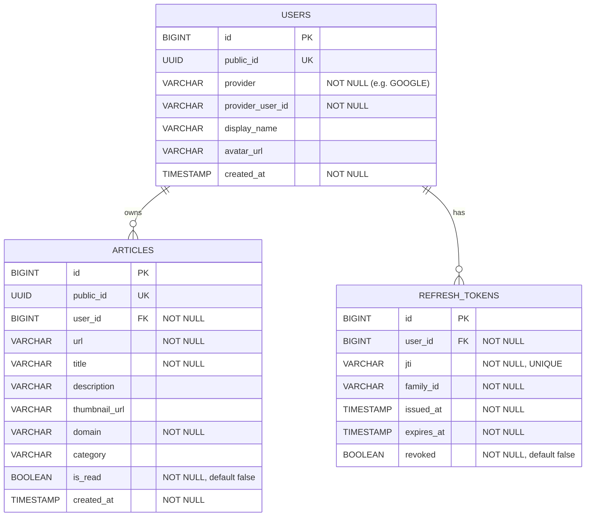

# ArKeep ERD (Google OAuth 湲곗?)

ERDCloud import??SQL?€ `backend/docs/erdcloud-import.sql` ?뚯씪???ъ슜.

## Constraints

- `users`: `UNIQUE(provider, provider_user_id)`
- `articles`: `INDEX(user_id)`, `INDEX(status)`, `UNIQUE(user_id, url)` (以묐났 ?€??諛⑹???
- `refresh_tokens`: `INDEX(user_id)`, `UNIQUE(token_hash)`

